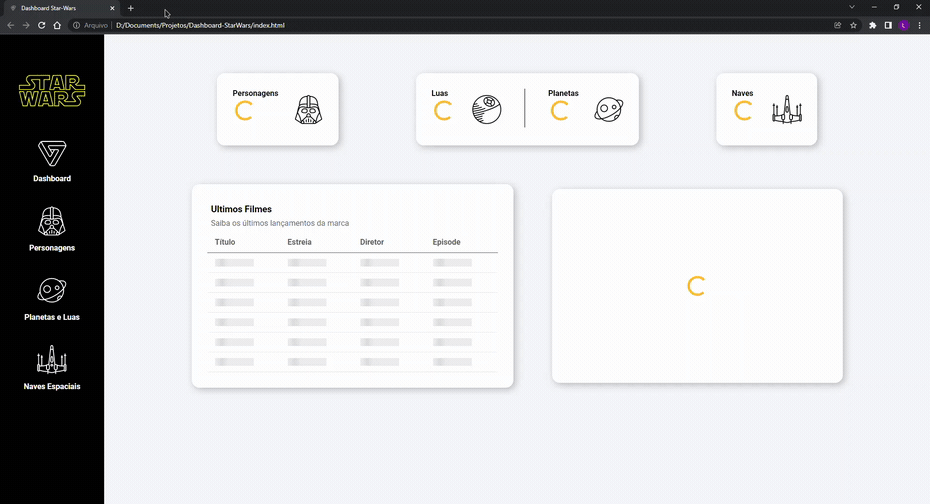

# Dashboard Star Wars

<p align="center">
  <a href="#o-projeto">Projeto</a>&nbsp;&nbsp;&nbsp;|&nbsp;&nbsp;&nbsp;
  <a href="#tecnologias">Tecnologias</a>&nbsp;&nbsp;&nbsp;|&nbsp;&nbsp;&nbsp;
<a href="#behavior">Behavior</a>&nbsp;&nbsp;&nbsp;|&nbsp;&nbsp;&nbsp;
  <a href="#executando-o-projeto">Executar</a>
</p>

## O Projeto
Este é um projeto desenvolvido com a intenção de aprendizagem de requisições com JavaScript.

Conceitos aprendidos com esse projeto
- Requisições com Axios
- Promises.
- Async Functions

## Tecnologias

Esse projeto foi desenvolvido com as seguintes tecnologias:

- HTML
- CSS (SCSS)
- JavaScript

Integrações
 - [The Star Wars API](https://swapi.dev/)
 - [Google Charts](https://developers.google.com/chart)

## Behavior
<p align="center">
	
</p>

## Executando o projeto

```bash
# Clone este repositório
$ git clone https://github.com/LeandroFilie/Dashboard-StarWars.git

# Acesse a pasta do projeto no seu terminal/cmd
$ cd Dashboard-StarWars
```
Para acesso de forma online, [clique aqui](https://dashboard-star-wars-leandrofilie.vercel.app/)

---
Feito com :heart: by [Leandro Filié](https://github.com/LeandroFilie)
